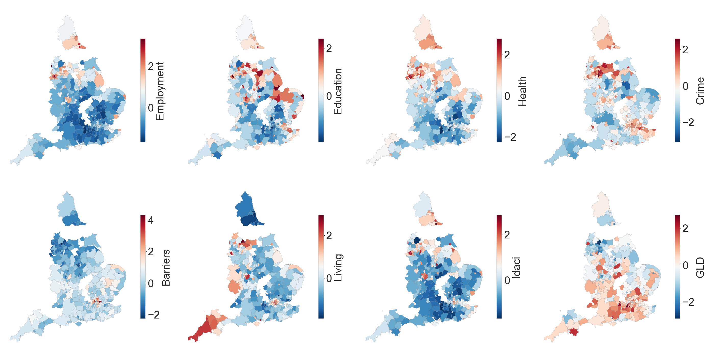
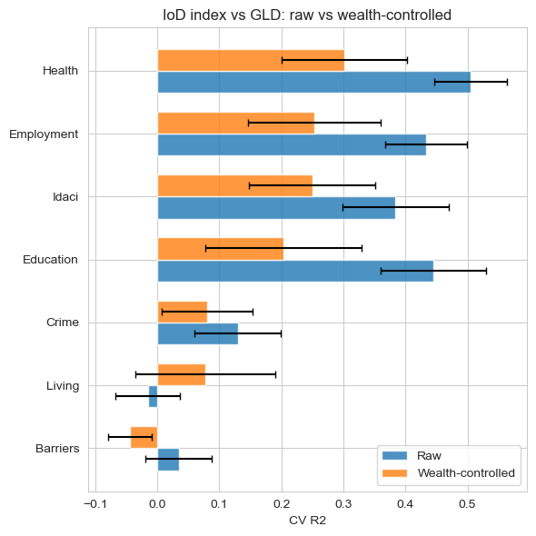
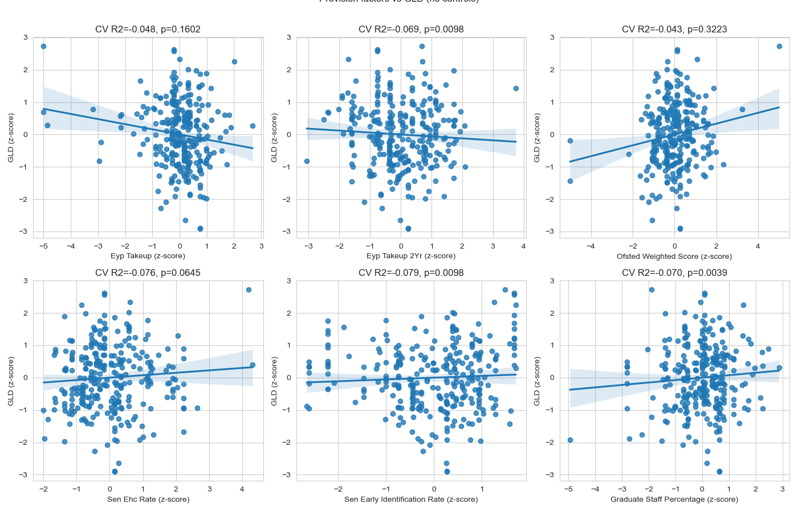

# Relationship Between Early Years Development, Deprivation, and Early Education Provisions in England

> [!NOTE]
> **tldr**: Area-level deprivation (Employment, Health, Education, Income) is strongly associated with early years
> development in England, even after controlling for household income. The early years provision measures I tested show
> no meaningful association with GLD outcomes, whether on their own or after accounting for deprivation.

An exploratory analysis of the relationship between area-level deprivation and early years development across local
authority districts in England. The project investigates whether early years provision factors (e.g. childcare take-up,
provider quality, SEN support) can account for variance in early years development outcomes beyond what deprivation
alone predicts, and whether these relationships hold after controlling for household income.

*

*[View the full analysis notebook](https://nbviewer.org/github/HollyMorley/school-readiness-and-deprivation-england/blob/master/analysis.ipynb)
**

## Background

The early years foundation stage profile (EYFSP) is a key measure of early years development in England, assessing
children's progress across seven areas of learning at the end of Reception (age 4–5). Children who achieve the expected
level in all early learning goals across communication and language, physical development, personal, social and
emotional development, literacy, and mathematics are said to have reached a Good Level of Development (GLD).

The indices of deprivation (IoD) are a set of area-level measures that capture multiple dimensions of deprivation,
including:

- **Income deprivation affecting children (IDACI)**
  Proportion of children aged 0–15 living in income-deprived households. A sub-index of the broader income
  deprivation domain.

- **Employment**
  Proportion of the working-age population involuntarily excluded from the labour market, including through
  unemployment, sickness, disability, or caring responsibilities.

- **Education, skills and training**
  Lack of attainment and skills in the local population, capturing both the "flow" (children's school attainment,
  absences, post-16 participation, and entry to higher education) and the "stock" (working-age adults without
  qualifications or with limited English proficiency).

- **Health deprivation and disability**
  Risk of premature death and impairment of quality of life through poor physical or mental health, including
  measures of premature mortality, morbidity, emergency hospital admissions, and mood and anxiety disorders.

- **Crime**
  Risk of personal and material victimisation at the local level, based on recorded rates of violence, burglary,
  theft, and criminal damage.

- **Barriers to housing and services**
  Physical and financial accessibility of housing and local services, including road distance to GPs, schools,
  post offices and shops, as well as household overcrowding, homelessness, and housing affordability.

- **Living environment**
  Quality of the indoor and outdoor local environment, including housing without central heating, homes failing
  the Decent Homes standard, air quality, and road traffic accidents involving pedestrians and cyclists.

Area-level deprivation is known to be strongly associated with children's early development outcomes. This project
asks: which dimensions of deprivation matter most for school readiness, and can local early years provision explain
why some areas do better or worse than their deprivation would predict?

To explore the second question, I draw on DfE data on early years provision at the local authority level:

- **EYP take-up (3–4 year olds)**
  Percentage of eligible children registered for the universal funded early education entitlement. Used as a measure of
  the proportion of children accessing early education/care.

- **EYP take-up (2 year olds)**
  Percentage of eligible children registered for the additional early education entitlement for disadvantaged
  two-year-olds. Included separately to test whether earlier access to funded provision is associated with later
  outcomes.

- **Ofsted quality score**
  Weighted average of provider Ofsted ratings (4 = Outstanding, 1 = Inadequate) for registered children, reflecting the
  overall quality
  of early years settings in the area.

- **SEN EHC plan rate**
  Of children identified with special educational needs, the percentage with an Education, Health and Care plan
  (formal, statutory support). Used as a proxy for the level of support provided to children with SEN.

- **SEN early identification rate**
  Of children with SEN, the percentage first identified in Nursery rather than Reception, as a proxy for how
  proactively needs are recognised.

- **Graduate staff in PVI settings**
  Percentage of children in private, voluntary, and independent settings with access to graduate-level staff. Used as a
  proxy for the quality of staff in early years settings.

Finally, to explore the role of household wealth in these relationships, I also examine the association between gross
disposable household income (GDHI) per head and early years development, and test whether the deprivation–GLD
relationships persist after controlling for these area-level household incomes.

## Key Findings

<figure>
  
  <figcaption>Figure 1: Indices of deprivation and Good Level of Development by local authority district, all z-scored. Most domains share a similar spatial pattern, with higher deprivation in the North and Midlands. Barriers and Living Environment are concentrated in London.</figcaption>
</figure>

Most IoD indices are strongly associated with GLD at the local authority level. Health, Education, Employment, and IDACI
are the strongest predictors (CV R² ~ 0.4–0.5), and these relationships persist after controlling for household income (
Figure 2).
This suggests that these deprivation domains capture dimensions of disadvantage beyond wealth alone, and that they are
robustly associated with early years development outcomes.
Barriers to Housing and Services is the only domain with a positive association with GLD - likely a London effect (see
Figure 1), as
the capital combines high housing pressures with relatively strong school outcomes. Living Environment and Crime are
weak predictors that don't survive the income control (Figure 2).

<figure>
  
  <figcaption>Figure 2: Cross-validated R² for each IoD domain predicting GLD, with and without controlling for household income (GDHI). Health, Employment, IDACI, and Education remain predictive after the income control.</figcaption>
</figure>

The provision measures I tested - early education take-up, Ofsted quality, SEN support, and graduate staff rates -
showed no meaningful association with GLD outcomes, either raw or after controlling for wealth and deprivation (Figure
3).

<figure>
  
  <figcaption>Figure 3: Provision factors vs GLD (no controls). None show a meaningful relationship.</figcaption>
</figure>

## Caveats

- The analysis is correlational and cannot establish causality.
- The analysis is somewhat circular, with deprivation measures likely capturing many of the same underlying factors that
  influence early years development.
- The deprivation data is from 2019, while the EYFSP data is from 2024/25, so there may be changes in deprivation levels
  that are not captured in the analysis.
- The analysis is at the local authority district level, which does not capture individual experiences of deprivation or
  provision.
- The provision factors are an attempt to capture the quality and accessibility of early years education, but they are
  imperfect proxies and may not fully reflect the nuances of local provision.
- I matched the provision data by year to accommodate the variety in age groups and reporting years.

## Conclusions

Deprivation - particularly health, education, employment, and income deprivation affecting children - is strongly
associated with early years development at the local authority level, and these relationships persist
after accounting for household income. However, the provision measures I tested (early education take-up, Ofsted
quality, SEN support, graduate staff rates) showed no meaningful association with GLD outcomes, whether raw or after
removing the variance explained by deprivation or wealth.

This doesn't mean these provisions don't matter. The wider literature suggests that what matters most is the quality of
provision and the home learning
environment ([Nesta, 2025](https://www.nesta.org.uk/toolkit/how-does-early-education-and-care-affect-childrens-development/)) -
neither of which is perhaps well captured by the area-level aggregate measures used here.

It's also worth noting that this analysis is somewhat circular. Deprivation indices like health and education likely
reflect many of the same underlying conditions that shape early development, so the strong correlations are partly
tautological. Wealth also correlates with nearly everything — both the deprivation measures and GLD - so disentangling
these relationships is inherently difficult.

Overall, several deprivation domains remain predictive of GLD after controlling for household income - even IDACI, which
directly measures child income deprivation - suggesting that these deprivation indices capture dimensions of
disadvantage beyond wealth alone. This could point to possible avenues for targeted regional support, though the
measures used
here are relatively coarse and the analysis is exploratory.

## Data Sources

All datasets are published under
the [Open Government Licence v3.0](https://www.nationalarchives.gov.uk/doc/open-government-licence/version/3/).

- Department for Education (2025). *Early years foundation stage profile results, Academic year 2024/25*. Explore
  Education Statistics. Available
  at: https://explore-education-statistics.service.gov.uk/find-statistics/early-years-foundation-stage-profile-results

- Ministry of Housing, Communities & Local Government (2019). *English indices of deprivation 2019*. GOV.UK. Available
  at: https://www.gov.uk/government/statistics/english-indices-of-deprivation-2019

- Department for Education (2025). *Funded early education and childcare, Reporting year 2025*. Explore Education
  Statistics. Available
  at: https://explore-education-statistics.service.gov.uk/find-statistics/education-provision-children-under-5

- Office for National Statistics (2024). *Regional gross disposable household income: local authorities by ITL1 region*.
  ONS. Available
  at: https://www.ons.gov.uk/economy/regionalaccounts/grossdisposablehouseholdincome/datasets/regionalgrossdisposablehouseholdincomelocalauthoritiesbyitl1region

- Office for National Statistics (2024). *Local Authority Districts (December 2024) Boundaries UK BFE*. ONS Open
  Geography Portal. Source: Office for National Statistics licensed under the Open Government Licence v.3.0. Contains OS
  data © Crown copyright and database right 2024.

## Project Structure

```
school-readiness-and-deprivation-england/
├── config.py                  # Shared paths and constants
├── analysis.ipynb             # Analysis notebook (view on [nbviewer](https://nbviewer.org/github/HollyMorley/school-readiness-and-deprivation-england/blob/master/analysis.ipynb))
├── src/
│   └── build_database.py      # Builds SQLite database from raw data files
├── sql/
│   ├── EYFSP_and_IMD.sql      # EYFSP + IMD join query
│   ├── EYFSP_and_IOD.sql      # EYFSP + all IoD domain join query
│   └── provision_factors.sql  # EYFSP + provision factors join query
├── data/
│   ├── early_years.db         # SQLite database (built from raw files)
│   ├── lad_boundaries.geojson
│   └── raw/                   # Raw source data files (see above)
└── output/
    └── iod_analysis/          # PDFs and summary CSV from test.py
```

## Setup

Requires [Miniconda](https://docs.anaconda.com/miniconda/) or Anaconda.

```bash
# Create the environment from the yml file
conda env create -f environment.yml

# Activate it
conda activate nesta
```

### Building the database

The analysis reads from a SQLite database built from the raw data files. These are not all included in the repository
and must be downloaded from the sources listed above into `data/raw/`. See `config.py` for the expected file paths.

Once the raw files are in place:

```bash
python src/build_database.py
```

This creates `data/early_years.db` from the CSV and Excel files in `data/raw/`.
